# Seattle AirBnB Listing Dataset (Rakamin Academy Final Project)
Dalam final project ini, kelompok kami ingin membuat machine learning yang bertujuan untuk memberikan wawasan yang diperlukan dan dapat membantu AirBnB dalam meningkatkan jumlah customer di Kota Seattle sehingga posisi mereka di pasar Kota Seattle semakin kuat. 

## Kelompok 2 ResNet
- Project Manager : Mohammad Fauzan
- Data Analyst    : Indah Mutiah Utami. MZ
- Data Engineer   : Yusuf Nafi Farhan
- Data Scientist  : Julian

## Daftar Isi
- [Prerequisites](#prerequisites)
- [Flow](#flow)
- [Penjelasan Sebelum EDA](#penjelasan-sebelum-eda)
- [EDA](#eda)
- [Business Insight](#business-insight)

## Prerequisites
1. Download data [here](https://drive.google.com/drive/folders/1q0uoNhUzHYL3TmhfwtFL-Xnb26rwOzRF?usp=sharing)
2. Clone repositori ini:
   ```bash
   git clone https://github.com/Podjan/ResNet2.git

## Flow
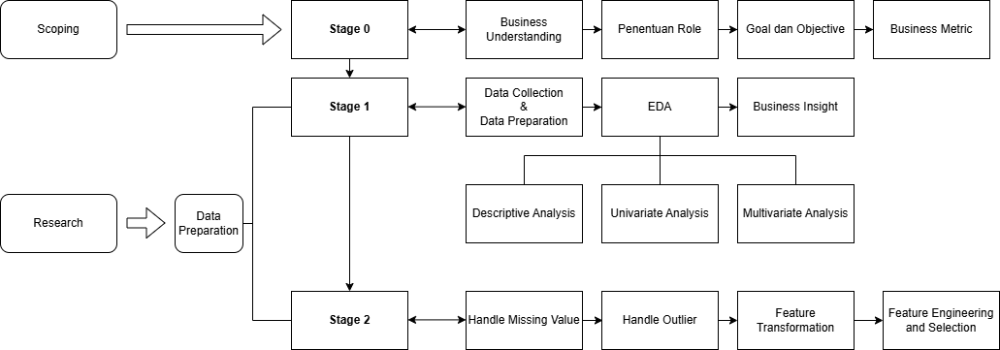

## Penjelasan Sebelum EDA
### Dataset
Ada tiga dataset pada pekerjaan kali ini. 
1. **Calendar** yang berisi tentang data penghasilan dari AirBnB selama setahun.
2. **Listings** yang berisi tentang data detail lengkap mengenai setiap listings.
3. **Reviews** yang berisi tentang ulasan dari setiap listing.

### Beberapa hal yang perlu diperhatikan
1. Penentuan kolom dan dataset yang diambil dilakukan diawal untuk meminimalisir resiko dan membuang yang tidak perlu.
2. Poin pertama bukan berarti selanjutnya tidak ada pengambilan keputusan untuk membuang kolom. Jika ada kolom yang korelasinya mendekati 1 kemungkinan akan dibuang juga.
3. Penentuan kolom dan dataset diawal juga didasari oleh goal dan objective yang ingin dicapai.

### Goal dan Objectives
#### Goal
Goals yang ingin dicapai dalam studi case ini adalah meningkatkan jumlah customer AirBnB di tahun berikutnya dengan memberikan wawasan yang akurat kepada pemilik AirBNB mengenai jenis properti yang paling diminati oleh tamu dan tingkat kepuasan para tamu, sehingga mereka dapat mengoptimalkan strategi pemasaran, penetapan harga, dan pengelolaan inventaris di tahun berikutnya.
#### Objectives
1. Memprediksi jumlah pengunjung di tahun berikutnya berdasarkan kualitas dan harga.
2. Meningkatkan tingkat kepuasan customer terhadap kualitas hotel yang pengunjungnya sepi.
3. Memprediksi harga hotel di tahun depan untuk memberikan rekomendasi harga yang tepat di setiap hotel.

### Langkah awal
1. Memisahkan kolom date menjadi kolom bulan dan tahun pada dataset calendar
2. Melakukan dropna karena pada dataset calendar, na itu avaiability dari listingnya false dan mengakibatkan tidak ada pemasukan untuk listing tersebut.
3. Untuk memudahkan melakukan analisa yang lain, kami melakukan groupby di dataset calendar yang bertujuan mendapatkan median price dan jumlah customer (jumlah id) dari masing listing id di setiap bulannya.
   ``` python
   df1g = df1.groupby(['listing_id', 'tahun', 'bulan_num']).agg(
       pendapatan_per_bulan=('pendapatan', 'sum'),
       median_price=('pendapatan', 'median'),
       jumlah_customer=('listing_id', 'size')
   ).reset_index()
   ```
4. Mengubah beberapa kolom di dataset listing menjadi tipe yang diinginkan
   ``` python
   # Mengubah data yang bertipe string ke float
   dfl2['price'] = dfl2['price'].str.replace('$', '').str.replace(',', '').astype(float)
   dfl2['weekly_price'] = dfl2['weekly_price'].str.replace('$', '').str.replace(',', '').astype(float)
   dfl2['monthly_price'] = dfl2['monthly_price'].str.replace('$', '').str.replace(',', '').astype(float)
   dfl2['host_response_rate'] = dfl2['host_response_rate'].str.replace('%', '').astype(float)
   dfl2['host_acceptance_rate'] = dfl2['host_acceptance_rate'].str.replace('%', '').astype(float)
   # Mengubah data yang beripe integer ke string
   dfl2['host_id'] = dfl2['host_id'].astype(str)
   dfl2['latitude'] = dfl2['latitude'].astype(str)
   dfl2['longitude'] = dfl2['longitude'].astype(str)
   ```
5. Memasukkan kolom jumlah id dari dataset calendar ke dataset listing.
   ```python
   df1g2 = df1g [['listing_id', 'pendapatan_per_bulan','jumlah_customer']]
   df1g3 = df1g2.groupby(['listing_id']).agg(
       total_pendapatan=('pendapatan_per_bulan', 'sum'),
       total_customer=('jumlah_customer', 'sum')).reset_index()
   # Menggabungkan df1g3 dan dfl2 berdasarkan 'listing_id dengan tujuan memembuat kolom jumlah_id di dataset listing
   dfl3 = pd.merge(df1g3, dfl2, on='listing_id', how='left')
   ```
6. Sekarang kita punya dua dataframe/dataset yang akan diolah
   ```python
   df1 
   df2 = dfl3
   ```

### Fitur yang akan digunakan
#### df1 (dataset calendar final)
- listing_id
- date
- bulan_num **(tambahan fitur di dataset calendar)**
- tahun **(tambahan fitur di dataset calendar)**
- pendapatan
#### df2 (dataset listing final)
- listing_id
- total_pendapatan **(tambahan fitur di dataset listing)**
- total_customer **(tambahan fitur di dataset listing)**
- name
- host_id
- host_response_time
- host_response_rate
- host_acceptance_rate
- host_is_superhost
- host_identity_verified
- zipcode
- latitude
- longitude
- is_location_exact
- property_type
- room_type
- accommodates
- bathrooms
- bedrooms
- beds
- bed_type
- price
- weekly_price
- monthly_price
- guests_included
- minimum_nights
- maximum_nights
- review_scores_rating
- review_scores_accuracy
- review_scores_cleanliness
- review_scores_checkin
- review_scores_communication
- review_scores_location
- review_scores_value
- instant_bookable
- cancellation_policy
- require_guest_profile_picture
- require_guest_phone_verification
#### Note: Untuk dataset review, dataset tersebut tidak kami masukkan sebagai model utama machine learning. Tetapi data itu akan kami gunakan sebagai model untuk melihat sentimen customer dari masing-masing listing. Kami menggunakan geminiAI untuk mengerjakan model tersebut. Untuk saat ini, codingnya ada di repository ini dengan nama API.ipynb.

## EDA
### Descriptive Statistic
Pada proses descriptive statistic ini, berguna untuk melihat nilai statistika dari setiap data yang sudah diolah sebelumnya. Pada bagian ini descriptive statistic menampilkan 2 data frame yang berguna untuk mempertimbangkan analisis selanjutnya.
#### df1
df1 merupakan data frame yang data sourcenya diambil dari dataset calendar. Sebelum dilakukan data cleansing terdapat sekitar 1.393.570 rows yang kemudian diolah dengan membuang missing valuenya sehingga feature payment yang awalnya 459028 didrop semua menjadi 0.

 | Features                 | Before | After |
 |--------------------------|--------|-------|
 | pendapatan               | 459028 | 0     |

Salah satu pertimbangan melakukan drop terhadap missing value adalah karena listing yang available saat itu berstatus false artinya pada saat itu penginapannya tidak available dan tidak ada proses transaksi pada listing tersebut. Hal ini sangat mempengaruhi proses selanjutnya mengingat goal yang ingin dicapai yaitu memprediksi jumlah pengunjung di tahun berikutnya dan memprediksi harga hotel di tahun depan, jadi membersihkan data null sangatlah penting dalam proses ini.    

Saat ini df1 mempunyai jumlah row sebanyak 934.542. Data tersebut adalah data transaksi dari semua listing.
 
Adapun hasil descriptive statistic nya adalah sbb:

|       |       listing_id | date                          |    bulan_num |          tahun |   pendapatan |
|:------|-----------------:|:------------------------------|-------------:|---------------:|-------------:|
| count | 934542           | 934542                        | 934542       | 934542         |   934542     |
| mean  |      5.30552e+06 | 2016-07-08 08:12:42.911458560 |      6.66112 |   2016.01      |      137.945 |
| min   |   3335           | 2016-01-04 00:00:00           |      1       |   2016         |       10     |
| 25%   |      2.87598e+06 | 2016-04-07 00:00:00           |      4       |   2016         |       75     |
| 50%   |      5.61562e+06 | 2016-07-08 00:00:00           |      7       |   2016         |      109     |
| 75%   |      7.87334e+06 | 2016-10-09 00:00:00           |     10       |   2016         |      160     |
| max   |      1.03402e+07 | 2017-01-02 00:00:00           |     12       |   2017         |     1650     |
| std   |      2.97482e+06 | nan                           |      3.4464  |      0.0778456 |      105.063 |

Dari hasil descriptive statistic tidak menunjukkan adanya data yang invalid dan sebagian besar datanya berasal dari tahun 2016 dengan rata-rata distribusi datanya berada dipertengahan bulan sekitar Juni-Juli. median dan mean pendapatan yang lebih tinggi dari standar devian menunjukkan data terkonsentrasi di nilai tengah. Karena mean pendapatan lebih tinggi dari median, maka data ini berbentuk right skewed. Standar devian yang mendekati nilai median pendapatan juga menunjukkan sebaran data yang lebar. Bentuk dari date bisa diperbaiki saat data transformation.

#### df2
df2 adalah data frame yang data source nya diambil dari dataset listing_id. data ini sangat berguna dalam analisis tingkat kepuasan customer. 

Pada df2 total data sebelum diolah ada sekitar 3818 rows listing penginapan. Selanjutnya, data terebut diolah dengan melakukan groupby berdasarkan listing_id untuk mendapatkan total customer dari masing-masing listing.
```python
 df1g3 = df1g2.groupby(['listing_id']).agg(
       total_pendapatan=('pendapatan_per_bulan', 'sum'),
       total_customer=('jumlah_customer', 'sum')).reset_index()
```
Sehingga dari hasil tersebut didapatkan total keseluruhan row adalah 3723 dengan 38 kolom. Adapun kolom-kolom yang masih memiliki missing value adalah sebagai berikut:
|                                  |      |
|:---------------------------------|-----:|
| host_response_time               |  480 |
| host_response_rate               |  480 |
| host_acceptance_rate             |  723 |
| host_is_superhost                |    2 |
| host_identity_verified           |    2 |
| zipcode                          |    7 |
| property_type                    |    1 |
| bathrooms                        |   16 |
| bedrooms                         |    6 |
| beds                             |    1 |
| weekly_price                     | 1750 |
| monthly_price                    | 2231 |
| review_scores_rating             |  622 |
| review_scores_accuracy           |  633 |
| review_scores_cleanliness        |  628 |
| review_scores_checkin            |  633 |
| review_scores_communication      |  626 |
| review_scores_location           |  630 |
| review_scores_value              |  631 |
  
   
Adapun missing value tersebut akan diolah lebih lanjut ditahap berikutnya. 

Berikut hasil descriptive statistic dari df2:
|                             |   count |            mean |             std |   min |             25% |             50% |            75% |              max |
|:----------------------------|--------:|----------------:|----------------:|------:|----------------:|----------------:|---------------:|-----------------:|
| listing_id                  |    3723 |     5.54805e+06 |     2.96979e+06 |  3335 |     3.24243e+06 |     6.11982e+06 |     8.0368e+06 |      1.03402e+07 |
| total_pendapatan            |    3723 | 34626.7         | 33041.2         |    49 | 13737.5         | 26935           | 44201.5        | 362941           |
| total_customer              |    3723 |   251.019       |   122.12        |     1 |   139           |   313           |   360          |    365           |
| host_response_rate          |    3243 |    94.8545      |    11.9244      |    17 |    98           |   100           |   100          |    100           |
| host_acceptance_rate        |    3000 |    99.9667      |     1.82574     |     0 |   100           |   100           |   100          |    100           |
| accommodates                |    3723 |     3.33306     |     1.96551     |     1 |     2           |     3           |     4          |     16           |
| bathrooms                   |    3707 |     1.25681     |     0.587699    |     0 |     1           |     1           |     1          |      8           |
| bedrooms                    |    3717 |     1.29782     |     0.873499    |     0 |     1           |     1           |     2          |      7           |
| beds                        |    3722 |     1.72864     |     1.13387     |     1 |     1           |     1           |     2          |     15           |
| price                       |    3723 |   126.993       |    88.5101      |    20 |    75           |   100           |   150          |   1000           |
| weekly_price                |    1973 |   787.725       |   534.051       |   100 |   455           |   650           |   950          |   6300           |
| monthly_price               |    1492 |  2604.68        |  1724.23        |   500 |  1507.5         |  2200           |  3100          |  19500           |
| guests_included             |    3723 |     1.65834     |     1.29537     |     0 |     1           |     1           |     2          |     15           |
| minimum_nights              |    3723 |     2.36557     |    16.5044      |     1 |     1           |     2           |     2          |   1000           |
| maximum_nights              |    3723 |   785.906       |  1702.45        |     1 |    60           |  1125           |  1125          | 100000           |
| review_scores_rating        |    3101 |    94.5485      |     6.62001     |    20 |    93           |    96           |    99          |    100           |
| review_scores_accuracy      |    3090 |     9.63625     |     0.699891    |     2 |     9           |    10           |    10          |     10           |
| review_scores_cleanliness   |    3095 |     9.56058     |     0.794371    |     3 |     9           |    10           |    10          |     10           |
| review_scores_checkin       |    3090 |     9.78835     |     0.594455    |     2 |    10           |    10           |    10          |     10           |
| review_scores_communication |    3097 |     9.80949     |     0.568215    |     2 |    10           |    10           |    10          |     10           |
| review_scores_location      |    3093 |     9.60782     |     0.631045    |     4 |     9           |    10           |    10          |     10           |
| review_scores_value         |    3092 |     9.45343     |     0.749484    |     2 |     9           |    10           |    10          |     10           |

Dari data tersebut tidak menunjukkan adanya data yang invalid. Selain itu, beberapa point yang bisa kita dapat dari data tesebut adalah :

1. Nilai rata-rata jumlah_id berkisar 251 dengan variasi sebesar 122 dan median 310, artinya beberapa listing memiliki sebagian besar total_customer nya 310 yang mana itu mengindikasikan bahwa total_customer memilik median > mean sehingga distribusinya cenderung negative skewed.
2. Nilai rata-rata total pendapatan setiap listing sekitar 34-35k dollar dan mediannya adalah 26,9k dollar. Hal ini berarti datanya bersifat right skewed, artinya ada listing-listing yang mempunyai pendapatan yang sangat tinggi dibandingkan kebanyakan listing-listing lain.
3. Untuk nilai kepuasan didapatkan dari  kolom host_response_rate, host_acceptance_rate, review_scores_rating, review_scores_accuracy, review_scores_cleanliness, review_scores_checkin, review_scores_communication, review_scores_location, review_scores_value, menunjukkan skor rata-rata untuk semua aspek mendekati nilai maksimum (9,5-10) yang artinya kebanyakan listing memiliki ulasan yang sangat positif.
4. Pada kolom price menunjukkan adanya perbedaan harga minimum dan maximumnya yang cukup jauh, artinya ada listing dengan harga yang sangat mahal dan sangat murah. Ini menandakan adanya outlier pada data ini. Selain itu, sebagian besar listing price per malamnya berkisar $105. 
5. Accomodates menunjukkan jumlah tamu yang dapat ditampung oleh suatu listing. Rata-rata kapasitas yang bisa ditampung adalah sekitar 3 tamu dengan sebagian besar listing mampu menampung 3-4 tamu.
6. Sebagian besar listing hanya memiliki satu kamar mandi, satu kamar tidur, dan satu hingga dua tempat tidur. Namun beberapa listing memiliki jumlah fasilitas yang tinggi, dengan nilai maksimum 8 kamar mandi, 7 kamar tidur, dan 20 tempat tidur.


### Univariate Analysis
Pada analisis univariate, untuk df2, kami mengelompokkan kolom yang bertipe float dan integer ke kolom bernama nums (numerical). Karena ada 21, kami membagi nums tersebut menjadi 5, yaitu nums21,nums22, nums23, nums 24, dan nums25. Tujuannya, agar tidak memberatkan pc saat melakukan run codingnya.
#### df1
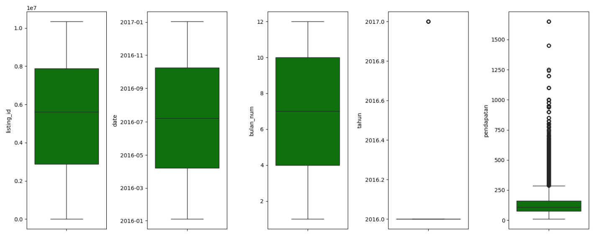
1. **Listing ID**:
Rentang nilai Listing ID sangat lebar. Tidak ada outlier yang signifikan.
2. **Date**: Distribusi data sangat merata di sekitar bulan 4-10.
3. **Bulan_num**: Distribusi data sangat merata dengan rentang bulan 4-10 (sama seperti date).
4. **Pendapatan**: Terdapat outlier yang sangat banyak mulai diatas 250 dollar.
5. **Tahun**: Data sebagian besar ada di 2016 akan tetapi ada outlier pada 2017 yang harus di analisis.
Untuk tahun 2017, data terakhir tahun 2017 adalah tanggal 2 bulan Januari 2017. Untuk date pertama di tanggal 4 bulan Januari 2016

#### df2
##### nums21
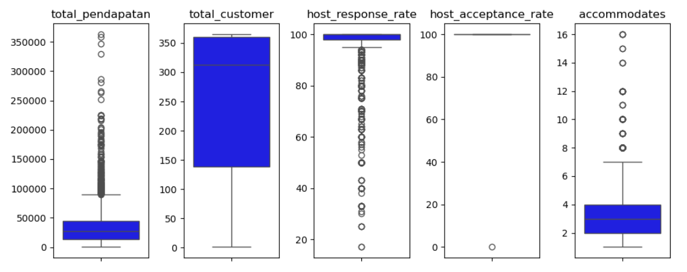
1. **total_pendapatan**: Distribusi pendapatan semua listing terpusat di sekitar 250k, dengan outlier mulai di atas 100k
2. **total_customer**: Distribusi terpusat di sekitar angka 300, menunjukkan total customer yang konsisten antar data. Kemungkinan mewakili jumlah ulasan atau interaksi, dengan nilai tinggi mengindikasikan listing yang populer.
3. **host_response_rate**: Banyak host dengan tingkat respons tinggi, tetapi ada juga yang sangat rendah. Hal ini menunjukkan bahwa responsivitas host cukup beragam, dengan yang cepat lebih disukai tamu.
4. **host_acceptance_rate**: Mayoritas host memiliki tingkat penerimaan mendekati 100%, tetapi ada juga yang lebih selektif. Host dengan penerimaan tinggi cenderung populer atau memiliki kebijakan khusus.
5. **accommodates**: Sebagian besar listing menampung hingga 4 orang, dengan beberapa outlier yang menampung lebih banyak. Kapasitas akomodasi beragam, dari 1-2 hingga lebih dari 8 orang.

##### nums22
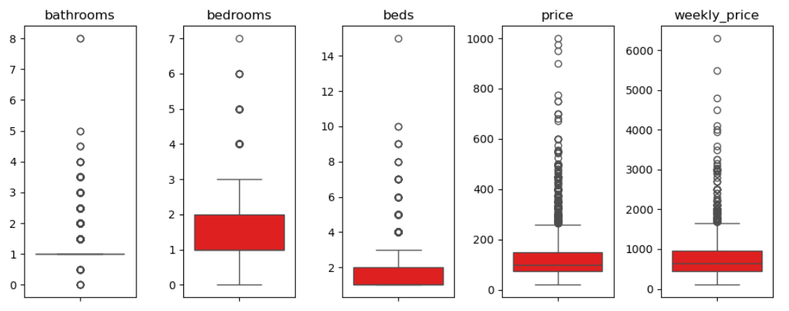
1. **bathrooms**: Sebagian besar listing memiliki 1-2 kamar mandi, dengan beberapa outlier yang memiliki lebih banyak. Fasilitas kamar mandi bervariasi, meski mayoritas terbatas.
2. **Bedrooms**: Sebagian besar listing memiliki 1-2 kamar tidur, cocok untuk individu atau keluarga kecil. Listing dengan lebih banyak kamar tidur biasanya untuk kelompok besar atau masa inap lebih lama.
3. **Beds**: Umumnya ada 2-4 tempat tidur per listing, dengan beberapa memiliki lebih banyak. Beberapa listing menawarkan tempat tidur tambahan, seperti sofa bed.
4. **Price**: Harga per malam bervariasi dengan median rendah, namun ada outlier dengan harga tinggi, dipengaruhi oleh lokasi, ukuran, dan fasilitas.
5. **Weekly_price**: Harga mingguan mirip dengan harga harian, biasanya kelipatan dengan diskon atau biaya tambahan.

##### nums23
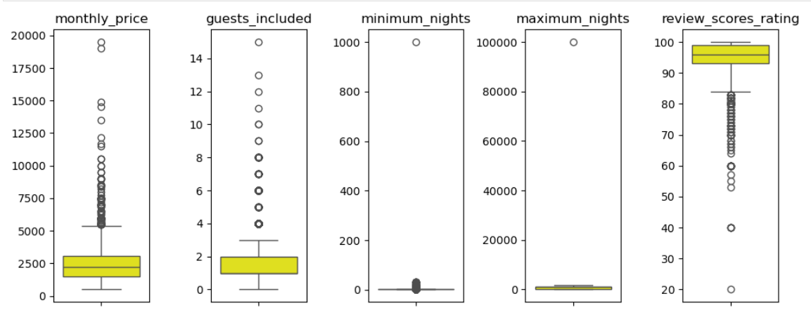
1. **Monthly_price**: Harga bulanan cenderung lebih murah per hari dibandingkan harga harian, sering kali disertai diskon.
2. **guests_included**: Sebagian besar listing dapat menampung hingga 4 tamu, dengan beberapa yang bisa menampung lebih dari 8 orang. Listing dengan kapasitas besar cocok untuk keluarga atau kelompok besar.
3. **minimum_nights**: Minimum menginap umumnya rendah (1-2 malam), dengan beberapa listing yang mensyaratkan durasi lebih lama untuk masa inap jangka panjang.
4. **maximum_nights**: Mayoritas listing memiliki batas maksimum menginap yang fleksibel atau tanpa batas, namun ada beberapa yang membatasi masa inap lebih pendek.
5. **review_scores_rating**: Sebagian besar listing memiliki rating tinggi (di atas 80), menunjukkan kualitas yang baik dan tamu yang puas.

##### nums24
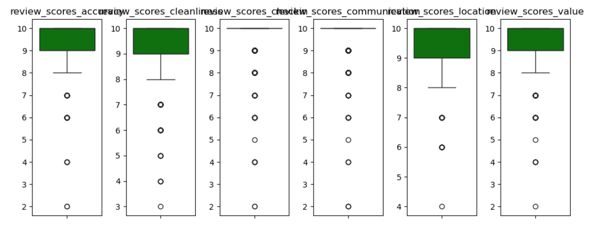
1. **review_scores_accuracy**: Skor akurasi deskripsi umumnya tinggi (di atas 8), menunjukkan deskripsi listing yang sesuai dengan ekspektasi tamu.
2. **review_scores_cleanliness**: Skor kebersihan mayoritas tinggi (di atas 8), menunjukkan host menjaga standar kebersihan yang baik.
3. **review_scores_checkin**: Skor check-in umumnya tinggi, meski ada beberapa kesulitan di beberapa listing.
4. **review_scores_communication**: Skor komunikasi juga tinggi, menandakan host responsif dan mudah diajak berkomunikasi.
5. **review_scores_location**: Skor lokasi tinggi, menunjukkan lokasi listing umumnya strategis dan mudah diakses.
6. **review_scores_value**: Skor nilai tinggi, menunjukkan tamu merasa puas dengan harga yang dibayar sesuai fasilitas yang diterima.

### Multivariate Analysis
#### df1
**Heatmap df1**
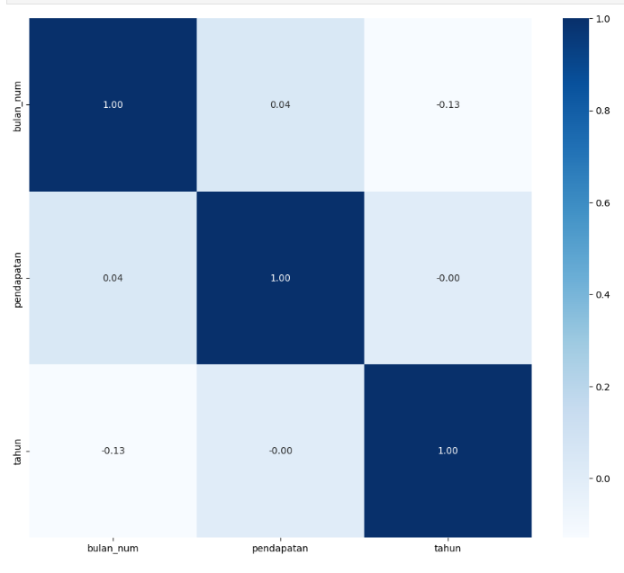
Heatmap ini menunjukkan matriks korelasi antar variabel dalam dataset, yaitu bulan_num, pendapatan, dan tahun. Berikut penjelasan dari korelasi antar variabel:
1. tahun dengan bulan_num (-0.13):
Korelasi negatif lemah, yang menunjukkan bahwa ketika tahun meningkat, bulan_num cenderung sedikit menurun. Namun, hubungan ini tidak terlalu kuat, sehingga tidak ada keterkaitan yang jelas antara tahun dan bulan_num.
2. tahun dengan pendapatan (-0.00):
Korelasinya negatif (hampir nol (karena angka dibelakang komanya hanya 2 jadi kelihatannya 0 padahal tidak)), yang menunjukkan bahwa ketika tahun naik maka pendapatan turun. Tetapi karena korelasinya sangat mendekati 0, maka tidak ada hubungan linear antara tahun dan pendapatan. Hal ini juga dikarenakan data tahun 2017 sangat sedikit, berakhir di tanggal 6 Januari 2017.
3. bulan_num dengan pendapatan (0.04):
Korelasi positif, ketidka bulan semakin mendekati akhir tahun maka pendapatan juga meningkat. Tetapi korelasinya hampir nol, menunjukkan tidak ada hubungan linear yang signifikan antara bulan_num dan median_price. Ini berarti bahwa perubahan dalam bulan_num tidak mempengaruhi pendapatan secara konsisten.


#### df2
**Heatmap df2**
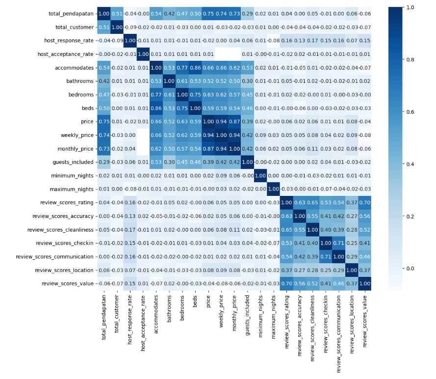
1. Korelasi Antar Variabel Fasilitas Properti
   - **(accommodates, bathrooms, bedrooms, dan beds)**:
     Terdapat korelasi yang cukup tinggi di antara variabel ini. Contohnya:
     - accommodates dan bedrooms memiliki korelasi sebesar 0.77.
     - bedrooms dan beds memiliki korelasi sebesar 0.75.
     - Korelasi yang tinggi ini menunjukkan bahwa jumlah kamar tidur (bedrooms), kamar mandi (bathrooms), dan tempat tidur (beds) cenderung bertambah seiring bertambahnya kapasitas (accommodates) properti. Hal ini logis karena properti yang lebih besar biasanya memiliki lebih banyak fasilitas.
    - **(price, weekly_price, dan monthly_price)**:
      Korelasi yang sangat tinggi antara price, weekly_price, dan monthly_price (0.94 hingga 1.00) menunjukkan bahwa harga harian, mingguan, dan bulanan sangat berhubungan dan  sejalan. Ketika harga harian meningkat, harga mingguan dan bulanan juga cenderung meningkat.
2. Korelasi Antar Variabel Skor Ulasan
   Variabel skor ulasan seperti review_scores_rating, review_scores_accuracy, review_scores_cleanliness, review_scores_checkin review_scores_communication, review_scores_location, dan review_scores_value memiliki korelasi positif yang cukup tinggi satu sama lain. Sebagai contoh:
   - review_scores_rating memiliki korelasi sebesar 0.70 dengan review_scores_cleanliness, 0.65 dengan review_scores_checkin, dan 0.70 dengan review_scores_value.
     Korelasi positif yang tinggi ini menunjukkan bahwa ketika suatu properti memiliki skor tinggi dalam satu aspek (misalnya cleanliness atau checkin), biasanya aspek lainnya juga mendapatkan skor tinggi. Ini dapat menunjukkan bahwa properti yang bagus dalam satu faktor cenderung berkinerja baik dalam faktor ulasan lainnya.
3. Hubungan Fasilitas Properti dengan Harga
   - **(accommodates, bathrooms, bedrooms, dan beds dengan price)**:
     Semua variabel ini memiliki korelasi positif moderat dengan price (0.53 hingga 0.63), menunjukkan bahwa semakin banyak kapasitas atau fasilitas yang dimiliki properti (lebih banyak kamar tidur, kamar mandi, atau tempat tidur), maka harga cenderung lebih tinggi.
   - **(guests_included dengan price)**:
     Korelasi positif antara guests_included dan price (0.46) menunjukkan bahwa harga cenderung lebih tinggi untuk properti yang mencakup lebih banyak tamu dalam tarif dasar.
4. Hubungan Skor Ulasan dengan Variabel Lain
   - **(review_scores_location dengan review_scores_value (0.37))**:
     Korelasi positif moderat menunjukkan bahwa properti yang memiliki nilai baik dalam location cenderung memiliki nilai tinggi juga dalam value.
   - **(review_scores_value dengan accommodates dan price (-0.07))**:
     Korelasi negatif kecil menunjukkan bahwa nilai ulasan value cenderung sedikit menurun jika kapasitas atau harga meningkat, yang bisa diartikan bahwa tamu merasa harga yang lebih tinggi atau kapasitas lebih besar tidak selalu sepadan.
5. Korelasi Total Pendapatan dengan Harga
   Total Pendapatan dengan kelompok harga (price, weekly_price, monthly_price) memiliki korelasi yang tinggi (0.75,0.74,0.73). Hal ini menunjukkan kelompok harga mempengaruhi pendapatan, ketika harga dinaikkan maka pendapatan akan naik.

## Business Insight
1. Jika kita melihat dua grafik dibawah, walaupun tren jumlah customer dan total pendapatan naik, tetapi di bulan Juni, terjadi keanehan antara dua tren tersebut, dimana jumlah customernya turun tetapi total pendapatannya naik. Kemungkinannya:
   - Ada beberapa listing yang mempunyai nilai price yang lebih tinggi dan listing-listing tersebut mengalami kenaikan customer, sedangkan listing-listing yang punya nilai price yang rendah customernya mengalami penurunan melebihi listing yang dijelaskan sebelumnya.
   - Ada beberapa customer yang menginap mingguan, sehingga mereka memilih harga weekly_price yang lebih tinggi daripada price.
   - Ada beberapa customer yang membayar biaya lain selain kelompok harga (price, weekly_price, day_price) dan hal itu melebih akumulasi nilai penurunan customer yang membayar nilai yang rendah (harga price saja di listing yang murah).

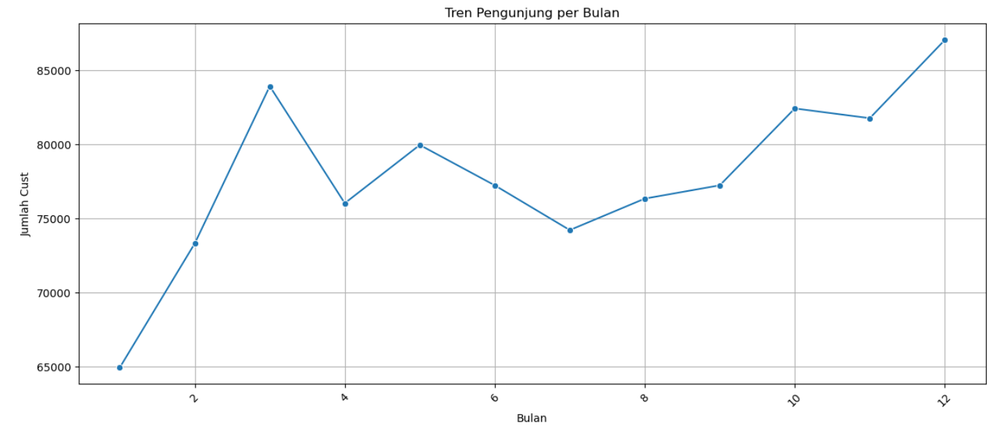
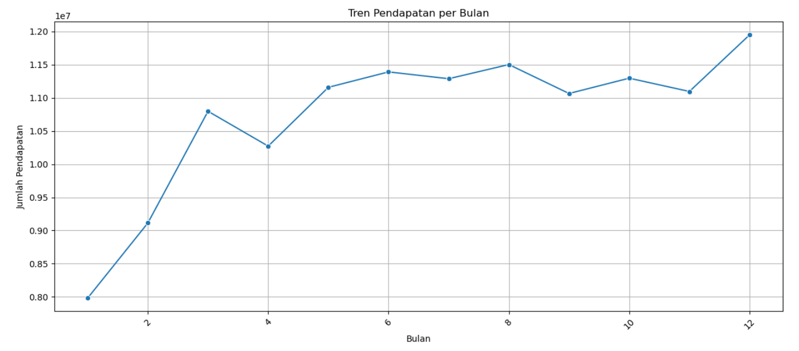

2. Listing yang mempunyai customer yang rendah, belum tentu mempunyai pendapatan yang rendah juga. Begitupun sebaliknya. Hal ini karena didasari oleh banyak faktor, seperti kelompok harga (price, weekly_price, day_price) yang berbeda di setiap listing, akomodasi dari listing tersebut yang mungkin bisa mempengaruhi kecenderungan orang memilih listing tersebut, biaya tambahan lainnya, dan banyak hal lain. Catatan: Dua tabel dibawah masih harus dibuang outliernya. Karena dari boxplot outlier dari total pendapatan tidak ada yang dibawah q1, tetapi listing yang hanya mendapatkan satu customer ada dibawah q1 (q1 nya adalah 139) jadi untuk membuangnya akan memakai inter quartil range. Begitu juga dengan pendapatan yang q1 nya sebesar 13,7k dollar.

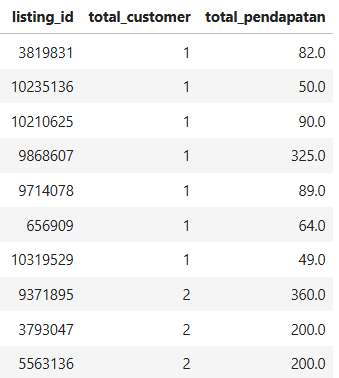
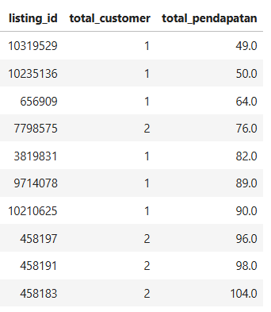

3. Mempunyai rating score yang tinggi belum tentu mempunyai pendapatan yang tinggi juga. Seperti padagrafik dibawah adalah top 10 listing dengan rating tertinggi dan yang kedua adalah top 10 listing dengan rating terendah. Pada tabel pertama, hanya dua listing dengan rating 100 yang pendapatannya melebihi q3 total pendapatan (44,2k dollar). Sedangkan pada tabel kedua, tidak ada yang menyentuh q3 total pendapatan. Perbdedaan lain dari dua tabel tersebut adalah rating yang tinggi memeiliki kecenderungan mempunyai customer yang lebih banyak dibandingkan rating yang randah. Hal ini bisa kita simpulkan sekilas bahwa rating rendah akan mempunyai kecenderungan pendapatan dan jumlah customer yang lebih sedikit. Oleh karena itu, listing yang mempunyai rating yang rendah harus menaikkan kualitas listing mereka.

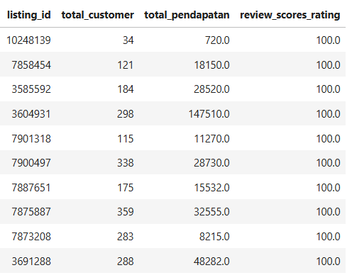
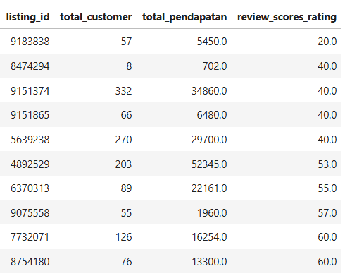

# STAGE 2 : DATA PREPROCESSING
## Handiling Missing Value dan Data Duplicate
1. Handling Missing Value
   Berikut adalah list fitur dengan missing valuenya :
    |                                  |    0 |
    |:---------------------------------|-----:|
    | listing_id                       |    0 |
    | total_pendapatan                 |    0 |
    | total_customer                   |    0 |
    | name                             |    0 |
    | host_id                          |    0 |
    | host_response_time               |  480 |
    | host_response_rate               |  480 |
    | host_acceptance_rate             |  723 |
    | host_is_superhost                |    2 |
    | host_identity_verified           |    2 |
    | zipcode                          |    7 |
    | latitude                         |    0 |
    | longitude                        |    0 |
    | is_location_exact                |    0 |
    | property_type                    |    1 |
    | room_type                        |    0 |
    | accommodates                     |    0 |
    | bathrooms                        |   16 |
    | bedrooms                         |    6 |
    | beds                             |    1 |
    | bed_type                         |    0 |
    | price                            |    0 |
    | weekly_price                     | 1750 |
    | monthly_price                    | 2231 |
    | guests_included                  |    0 |
    | minimum_nights                   |    0 |
    | maximum_nights                   |    0 |
    | review_scores_rating             |  622 |
    | review_scores_accuracy           |  633 |
    | review_scores_cleanliness        |  628 |
    | review_scores_checkin            |  633 |
    | review_scores_communication      |  626 |
    | review_scores_location           |  630 |
    | review_scores_value              |  631 |
    | instant_bookable                 |    0 |
    | cancellation_policy              |    0 |
    | require_guest_profile_picture    |    0 |
    | require_guest_phone_verification |    0 |

- Pada fitur weekly_price dan monthly_price missing valuenya dihandle dengan mengisinya menjadi nilai 0, sebab diasumsikan bahwa penginapan tersebut memang tidak menyediakan data weekly_price dan monthly_price.
-  Kolom-kolom review skor (review_scores_rating, review_scores_accuracy, dll.) memiliki nilai missing yang diisi berdasarkan median dari skor-skor tersebut, dikelompokkan berdasarkan room_type.Misalnya, semua properti dengan room_type = 'Entire home/apt' akan mengisi nilai missing berdasarkan median skor review dari tipe ruangan tersebut. Pendekatan ini logis karena skor cenderung berbeda tergantung tipe ruangannya
- Nilai missing untuk kolom host_response_rate, host_acceptance_rate, bathrooms, bedrooms, dan beds diisi dengan median dari kolom tersebut.
- Nilai kategorikal yang memiliki missing value seperti host_response_time, host_identity_verified, host_is_superhost, property_type dihandle dengan menggunakan mode atau kategori yang paling umum
- Untuk handling data zipcode tidak bisa dilakukan dengan mengandalkan data mean, medaian, mode saja karena datanya berkaitan erat dangan latitude dan longitude maka dari itu agar zipcode yang kosong terisi dengan nilai yang sesuai maka dibutuhkan library Reverse Geocoding

Hasil setelah handling missing value 
    |                                  |   0 |
    |:---------------------------------|----:|
    | listing_id                       |   0 |
    | total_pendapatan                 |   0 |
    | total_customer                   |   0 |
    | name                             |   0 |
    | host_id                          |   0 |
    | host_response_time               |   0 |
    | host_response_rate               |   0 |
    | host_acceptance_rate             |   0 |
    | host_is_superhost                |   0 |
    | host_identity_verified           |   0 |
    | zipcode                          |   0 |
    | latitude                         |   0 |
    | longitude                        |   0 |
    | is_location_exact                |   0 |
    | property_type                    |   0 |
    | room_type                        |   0 |
    | accommodates                     |   0 |
    | bathrooms                        |   0 |
    | bedrooms                         |   0 |
    | beds                             |   0 |
    | bed_type                         |   0 |
    | price                            |   0 |
    | weekly_price                     |   0 |
    | monthly_price                    |   0 |
    | guests_included                  |   0 |
    | minimum_nights                   |   0 |
    | maximum_nights                   |   0 |
    | review_scores_rating             |   0 |
    | review_scores_accuracy           |   0 |
    | review_scores_cleanliness        |   0 |
    | review_scores_checkin            |   0 |
    | review_scores_communication      |   0 |
    | review_scores_location           |   0 |
    | review_scores_value              |   0 |
    | instant_bookable                 |   0 |
    | cancellation_policy              |   0 |
    | require_guest_profile_picture    |   0 |
    | require_guest_phone_verification |   0 |


2. Tidak ditemukan data duplicate pada data df2 

## Handling Outlier dan Feature Transformation
Kedua hal ini berkaitan satu sama lain. Jika kita lihat melalui boxplot, kolom-kolom tipe integer dan float masih banyak terdapat outlier.


Oleh sebab itu kita harus kurangi outliernya. Stepnya adalah
1. Kolom 'review_scores_accuracy', 'review_scores_cleanliness', 'review_scores_checkin', 'review_scores_communication', 'review_scores_location', 'review_scores_value' tidak di standardisasi karena walau bentuknya numerik, tapi sudah dalam skala 1-10.
2. Tiga kolom (host_response_rate, host_acceptance_rate, dan review_scores_rating) yang memiliki rentang nilai 0-100 menjadi kategori berdasarkan rentang yang telah ditentukan:
   - 0-30: Sangat Buruk
   - 31-60: Buruk
   - 61-80: Sedang
   - 81-90: Baik
   - 91-100: Sangat Baik
3. Kita bikin log untuk kolom total_pendapatan, accommodates, bathrooms, bedrooms, beds, price, weekly_price, monthly_price, guests_included, minimum_nights, maximum_nights.

Hasilnya akan seperti ini
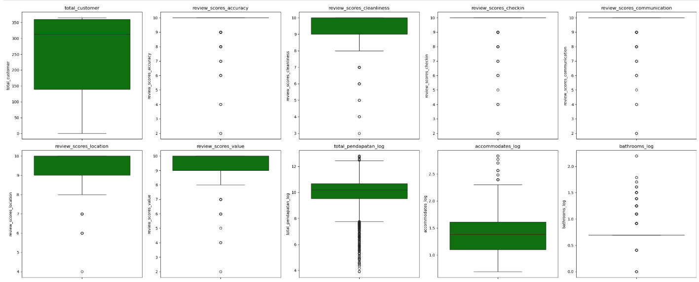
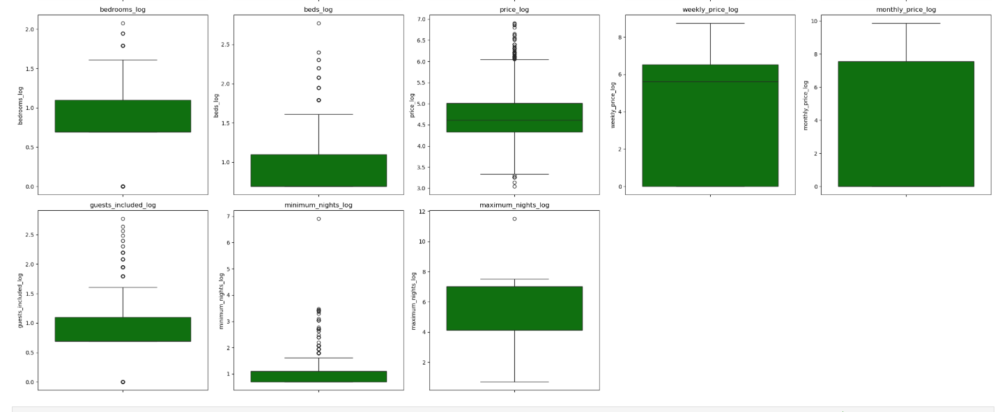

## Feature Encoding
Pada tahap ini, mengubah data kategorikal menjadi bentuk numerik agar dapat digunakan oleh model machine learning. Ada dua teknik utama yang digunakan:

**One-Hot Encoding**:

1. Digunakan untuk kolom kategorikal nominal, di mana tidak ada urutan atau tingkatan antar kategori. Contohnya: host_response_time, property_type, room_type.
2. Setiap nilai unik pada kolom tersebut diubah menjadi kolom baru (dummy variable) dengan nilai 0 atau 1.
3. drop_first=True digunakan untuk menghindari multicollinearity dengan menghapus salah satu kolom dummy.

**Label Encoding**:

1. Digunakan untuk kolom kategorikal ordinal, di mana ada urutan atau tingkatan antar kategori. Contohnya: review_scores_rating_kategori (Sangat Buruk, Buruk, Sedang, Baik, Sangat Baik).
2. Setiap nilai unik diubah menjadi angka urut.
3. Contoh: 'Sangat Buruk' menjadi 0, 'Buruk' menjadi 1, dan seterusnya.

**Kolom yang Diencode**:

**One-Hot Encoding**: ```host_response_time, host_is_superhost, host_identity_verified, is_location_exact, property_type, room_type, bed_type, instant_bookable, cancellation_policy, require_guest_profile_picture, require_guest_phone_verification.```

**Label Encoding**: ```review_scores_rating_kategori, host_response_rate_kategori, host_acceptance_rate_kategori.```

## Feature Selection
Pada tahap ini kami melakukan analisis mengenai kolom mana saja yang harus dibuang agar menghindari multikolinearitas.

