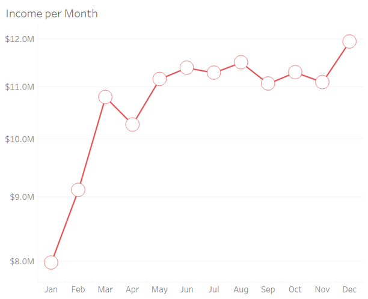

# Predictive Analytics for Growth: Strategic Recommendations for Airbnb in Seattle (Rakamin Academy Data Scientist Bootcamp Final Project)
- Our application is available on [streamlit-cloud](https://resnet2-deployy.streamlit.app/)
- CSV tamplate to try our application >>> [sample-data](https://drive.google.com/file/d/1QPgiJT44dmH-6Dh_2Odu2mvbIbf_wEtt/view?usp=sharing)

## ResNet Team
- Project Manager : Mohammad Fauzan
- Data Analyst    : Indah Mutiah Utami. MZ
- Data Engineer   : Yusuf Nafi Farhan
- Data Scientist  : Julian

## Contents
- [Prerequisites](#prerequisites)
- [Flow](#flow)
- [Library dan Version](#library-dan-version)
- [Stage 0](#stage-0)
- [Stage 1](#stage-1)
- [Stage 2](#stage-2)
- [Stage 3](#stage-3)
- [Stage 4](#stage-4)

## Prerequisites
1. Download data [here](https://drive.google.com/drive/folders/1q0uoNhUzHYL3TmhfwtFL-Xnb26rwOzRF?usp=sharing)
2. Clone this repository:
   ```bash
   git clone https://github.com/Podjan/ResNet2.git

## Flow


## Library dan Version
- Numpy: 1.26.4
- Pandas: 2.2.2
- Matplotlib.pyplot: 3.8.4
- Seaborn: 0.13.2
- Geopy: 2.4.1
- Scikit-learn: 1.4.2
- Math: 3.12.4
- Joblib : 1.4.2


## Stage 0

### Problem
At the start of a new year, Airbnb aims to increase both revenue and the number of customers utilizing its accommodation services. This effort also seeks to maintain competitive positioning in the marketplace. Hosts face challenges in optimizing their listings performance due to limited insights into the factors influencing customer acquisition and revenue. This project seeks to identify the key drivers of Income and Customer, leveraging advanced modeling techniques to deliver actionable business recommendations and empower hosts to enhance their listing performance.

### Goal
1. Identify key factors (features) that influence:
- Mean Income: Average income per month for a listing.
- Mean Customer: Average number of customers per month for a listing.
2. Provide actionable business recommendations to optimize both customer acquisition and income generation for Airbnb listings.


## Business Metric
### Objectives
1. Analyze most important features using appropriate model.
2. Develop recommendations based on findings to enhance listing performance

### Business Metric
1. Increase in Mean Income: Total revenue per month per listing.
2. Increase in Mean Customer: Number of customers per month per listing.

Current Status:
- Business metrics are not yet quantitatively measurable as the recommendations are derived from historical data and predictive models.
- Future validation of these metrics requires implementation of recommendations and measurement through experiments such as A/B testing or real-world data collection.


## Stage 1
### Dataset
There are three datasets in this work.
1. **Calendar** which contains data on AirBnB income from listings for a year.
2. **Listings** which contains complete detailed data on each listing.
3. **Reviews** which contains reviews of customer experience for listings.
The datasets we use are the calendar dataset and the listing dataset.

Notes:
- The calendar dataset has income info from all listings and is recorded daily. The time span is from January 4, 2016 - January 2, 2017.
- The calendar dataset is used to get the average revenue per month and the average customer per month for each listing.

### EDA
#### Descriptive Statistics
- Df2 is a data frame sourced from the dataset listing_id. This data is highly valuable for analyzing customer satisfaction levels. In df2, the total data before processing consists of approximately 3,818 rows of accommodation listings. The data is then processed by performing a groupby operation based on listing_id to obtain the total number of customers for each listing.
- As a result, the number of rows obtained was 3,723 with 38 columns. Columns that still contain missing values ​​can be seen in the image below.
- Next, df2 will get two additional columns, namely mean income and mean customer which are processed from df1.
- Mean Income is the average monthly income from each listing, and Mean Customer is the average customer per month for each listing.
- The way to get it is to take the median for income and customers every month for one year and then average it.


For the destriptive statistics:


The data does not indicate the presence of any invalid entries. Additionally, several key points can be derived from the data:
- The average value of jumlah_id is around 251, with a median of 310, indicating a negatively skewed distribution.
- The average total revenue per listing is around 34-35k, with a median of 26.9k, indicating a right-skewed distribution due to some listings generating much higher revenue.
- Satisfaction scores, based on host and review columns, are mostly close to the maximum (9.5-10), indicating very positive reviews for most listings.
- The price column shows a wide range between the minimum and maximum values, indicating the presence of outliers. 

#### Univariate Analysis

- Data analysis shows an average revenue of around $250,000, with some very high values. Most listings are popular, with an average of 300 customers.
- Hosts are generally responsive and accept nearly all requests. The majority of listings are suitable for 4 or fewer guests, though some can accommodate more.


- Analysis of amenities and prices shows that most properties have 1-2 bathrooms and bedrooms, suitable for individuals or small families. The number of beds typically ranges from 2-4, though some properties offer more.
- Nightly prices vary, influenced by location and additional amenities. Weekly rates generally follow the daily pricing pattern, often with special offers.


- The data shows that listings offer more competitive daily rates for monthly bookings, often with discounts. These accommodations, usually suitable for up to four guests, are ideal for small groups or families.
- While most require a minimum stay of one to two nights, some offer more flexibility. Many listings allow unlimited stays, and review scores indicate overall guest satisfaction.


- Based on review data, most listings receive high scores for description accuracy, cleanliness, communication with hosts, and strategic location.
- Scores for the check-in process are generally good, though some issues have been reported. Overall, guests are satisfied with the value they receive for the price paid.

#### Multivariate Analysis

- Correlation analysis shows a strong relationship between the number of rooms and the number of beds.
- Additionally, review scores for cleanliness, check-in, and value are highly correlated with overall review scores.
- Amenities such as the number of rooms, bathrooms, and beds have a moderate positive correlation with price.
- Location and value review scores also show a positive correlation, while the number of guests a property can accommodate has a weak negative correlation with price.
- Finally, total revenue is strongly correlated with daily, weekly, and monthly rates.

#### Business Insight
1. Income Trends per Month:
- Total income increased from January to June After that, income tended to be stable with slight fluctuations until the end of the year, then increased significantly in December.


2. Visitor Trends per Month:
- The total number of visitors (customers) shows a similar pattern to income, with exception from April to October.
- The spike in March and December could indicate a peak season.
- March shows the highest number of visitors initially, but there was a decrease in April, June, and July. This pattern is different from income trend.


3. Difference in Top 5 Income and Customer:
- The differences in several periods for income and customer trends, and also the differences in the top 5 listings seen from income and customers, can at a glance illustrate that the relationship between income and customers is not always directly proportional. This can also show that the main factors that influence income and customers are different, and the way they are handled is also different.


## Stage 2
### Handiling Missing Value and Data Duplicate
Missing values were handled using specific strategies: weekly_price and monthly_price were replaced with 0, while review scores features were imputed with the median based on room_type. Numerical features like host_response_rate, bathrooms, and beds were filled with their median, and categorical features like host_response_time and property_type were imputed with the mode. These methods ensure the dataset remains complete and reliable for analysis.


### Handling Outlier and Feature Transformation
Handling Outliers and Feature Transformation are related to each other. If we look through the boxplot, the integer and float type columns still contain many outliers.


But, since we will use the entire listing, we cannot remove outliers because it will delete many listings. Therefore, we will change the data distribution by using log. The goal was to normalize the data distribution and reduce the influence of outliers on the model, without losing any valuable information that might be contained within them. The data distribution before being handled is like this:


The steps are
1. The columns 'review_scores_accuracy', 'review_scores_cleanliness', 'review_scores_checkin', 'review_scores_communication', 'review_scores_location', 'review_scores_value' are not standardized because even though they are in numeric form, they are already on a scale of 1-10.
2. Three columns (host_response_rate, host_acceptance_rate, and review_scores_rating) that have a value range of 0-100 are categorized based on the specified range:
   - 0-30: Very bad
   - 31-60: Bad
   - 61-80: Average
   - 81-90: Good
   - 91-100: Very Good
3. We create log coloumn for accommodates, bathrooms, bedrooms, beds, price, weekly_price, monthly_price, guests_included, minimum_nights, maximum_nights.


The result will be like this:


### Feature Encoding
At this stage, categorical data is transformed into numeric form to be utilized by machine learning models. Two main techniques are employed:

**One-Hot Encoding:**

Used for nominal categorical columns, where there is no order or hierarchy among the categories. For example: host_response_time, property_type, room_type.
Each unique value in the column is transformed into a new column (dummy variable) with values of 0 or 1.
drop_first=True is used to avoid multicollinearity by removing one of the dummy columns.

**Label Encoding:**

Used for ordinal categorical columns, where there is an order or hierarchy among the categories. For example: review_scores_rating_kategori (Very Bad, Bad, Average, Good, Very Good).
Each unique value is converted into an ordered number.
Example: 'Very Bad' becomes 0, 'Bad' becomes 1, etc.


### Feature Selection
- The feature selection process began with analyzing the correlation matrix, where features with high correlations, such as price_log and mean_income (correlation > 0.80), were evaluated. While one feature is typically dropped to avoid redundancy, both were retained due to their contextual importance. 
- Moreover, due to the large number of features of df2, we try to reduce them also by trying to remove large correlations marked with red circles.


- The features dropped are: 'beds_log','review_scores_communication','review_scores_value', 'review_scores_cleanliness','bathrooms_log','weekly_price_log','monthly_price_log','require_guest_profile_picture_t'.

## Stage 3
### Final Feature Selection
Previously, we have tried three models (Linear Regression, Random Forest, and SVR) using all the features before this section, and the r2 results are very poor. The next model, we want to use PCA, but PCA can only be for continuous columns, so we decided to remove all binary columns, and for continuous columns, we do a multicollinearity test using Variance Inflation Factors (VIF).

There are variables with very high VIF values, such as:
- review_scores_accuracy (273.91)
- review_scores_location (270.91)
- maximum_nights_log (10.93)
However, the variables mean_customer and price_log are not removed for specific reasons:
mean_customer is the target variable, so it is not used as an independent feature in the model.
price_log is a key feature important for predictions, so it is retained despite having a high VIF value.


### Data Split
The regression model was chosen to predict the average income and average customer because of the good nature of regression in solving continuous value predictions (numerical) or evaluating the relationship between independent variables (input) and dependent variables (output)

RMSE and R² are the two main metrics that are most influential in evaluating linear regression models.

The data was split with a division of 80% for training data and 20% for testing data :
- Train Income =  2978
- Test Income = 745
- Train Customer = 2978
- Test Customer = 745 


### Model Comparison
We tried to use four different models:
- Liniear Regression
- Random Forest
- SVR
- SVR with PCA

SVR with PCA is the model with the best prediction results among the other 3 models in predicting income and customers. This is because the combination of SVR + PCA has low error and consistent performance on train and test data.


### Hyperparameter Tuning
For the hyperparameter tuning, RandomizedSearchCV was used to find the best combination of hyperparameters based on the r² score.
1. Grid Parameters for SVR:
- C: Regularization coefficient, taken from a uniform distribution between 1 to 11.
- epsilon: Margin in SVR regression, taken from a uniform distribution between 0.1 to 1.
- gamma: Kernel scale (scale or auto).

2. RandomizedSearchCV
- n_iter=20: Tries 20 parameter combinations randomly.
- cv=3: Uses 3-fold cross validation.
- n_jobs=-1: Parallelize to speed up the process.

For the best parameters:
1. Best Parameters for mean_income: {'C': 9.892370829281072, 'epsilon': 0.40461376917337066, 'gamma': 'scale', 'kernel': 'linear'}
2. Best Parameters for mean_customer: {'C': 1.1459145727585318, 'epsilon': 1.0422017556848528, 'gamma': 'auto', 'kernel': 'linear'}


### Feature Importance
- The PC that has the largest contribution in predicting mean_income is PC1. From PC1, the most important feature is host_response_rate_kategori whic is very dominant compared to other features, indicating that the response from the host plays a major role in determining the average income.


- The most influential PC in predicting mean_customer is PC2 where the most important feature is review_scores_rating_kategori which has the largest influence in determining the average number of customers. This shows that customer review ratings are more important in determining the average number of customers than other factors, although host response is also significant.


### Feature Analysis
#### Feature Analysis: PC1 (Mean Income)
Key Features in PC1:
1. Positive Contribution:
- Host Response Rate Category: High response rates from hosts improve customer satisfaction, leading to increased income.
- Review Scores Category: Higher review scores positively correlate with mean income, likely due to increased trust and attractiveness of listings.

2. Negative Contribution:
- Bedrooms (log): Larger listings may not align with customer demand, reducing occupancy rates.
- Price (log): Listings with higher prices may deter potential customers in the non-premium segment, resulting in lower total income.
- Minimum Nights (log): Stricter minimum stay policies reduce booking flexibility, decreasing income.
- Guests Included (log): Listings with higher included guest counts might price out smaller groups or individuals.


#### Feature Analysis: PC2 (Mean Customer)
Key Features in PC2:
1. Positive Contribution:
- Review Scores Rating Category: Listings with higher review scores attract more customers by building trust and indicating quality experiences, encouraging bookings.
- Price (log): Higher prices may indicate premium listings with better quality, attracting more customers.
- Bedrooms (log): Larger listings might appeal to families or groups, increasing customer numbers.
- Minimum Nights (log): Listings with higher minimum night requirements might attract longer-term travelers and listings with higher minimum nights might have lower price.
- Guests Included (log): More inclusive guest options can attract larger parties.

2. Negative Contribution:
- Host Response Rate Category: Despite high host response rates, most listings already cluster at high response levels, leading to diminished variation in customer impact.


### Contradiction Analysis
#### Price Contradiction:
1. Price (log) in PC1 (Mean Income)
Assumption: Higher prices may deter customers in non-premium segments, leading to lower income.
2. Price (log) in PC2 (Mean Customer)
Assumption: Higher prices can attract wealthy customers who associate high cost with quality, leading to more bookings for premium listings.

#### Minimum Nights Contradiction:
1. PC1 (Mean Income - Negative Contribution): 
Assumption: Listings with higher minimum nights may attract long-term stays where price might be lower, reducing overall income per booking. 
2. PC2 (Mean Customer - Positive Contribution): 
Assumption: Listings with higher minimum night requirements may attract long-staying customers, increasing the total number of unique bookings as these customers occupy the listing for extended durations.

#### Cause:
The Nature of PCA
The nature of PCA (Principal Component Analysis) which functions to reduce dimensions by creating principal components (Principal Component Analysis) based on data variance.
1. PCA measures combinations of features, not direct effects.
2. Variables can show different contributions depending on the context of the principal components.

### Business Recommendation
#### For Increasing Mean Income:
1. Improve the quality of listings and guest experiences.
2. Improve Host Responsiveness.
3. Hosts need to identify ideal number of bedrooms to demand.
#### For Increasing Mean Customer:
1. Reducing minimum nights requirement to attract more travelers/short-term tourists.
2. Hosts need to promote larger listings (high guess counts) without additional fee to attract larger group of tourists.
#### For Price Contradiction:
Listing Segmentation Based on Premium and Non-Premium Categories.
1. Higher-priced (premium) listings should focus on attracting customers with high purchasing power with exclusive benefits.
2. Lower-priced (non-premium) listings can target customers in the budget segment with more competitive offers, such as discounts for long stays or seasonal promotions.


## Stage 4 
### Deployment 
1. Install the required libraries: 
   `pip install streamlit pandas numpy scikit-learn joblib`
2. Make python file for deployment and ensure the code is free of bugs.
3. Run in local terminal
  `streamlit run your_file_deploy.py` ex: `streamlit run deploy-v1`
4. Ensure the requirements.txt file is available. This file is essential for deploying on the cloud because the application will not run on Streamlit Cloud without it. The requirements.txt file should include all necessary libraries.
5. Access [streamlit-cloud](https://streamlit.io/cloud) and login with github.
6. Create app.
7. Select your repository and deployment file.
8. Wait a moment, and the deployment will run on Streamlit Cloud.

Try the demo [here](https://resnet2-deployy.streamlit.app/)

Note: 
Do the pre-processing first!
Save your pre-processing file
Example pre-processing file [here](https://github.com/Podjan/ResNet2/blob/main/new_listings_data.csv)
